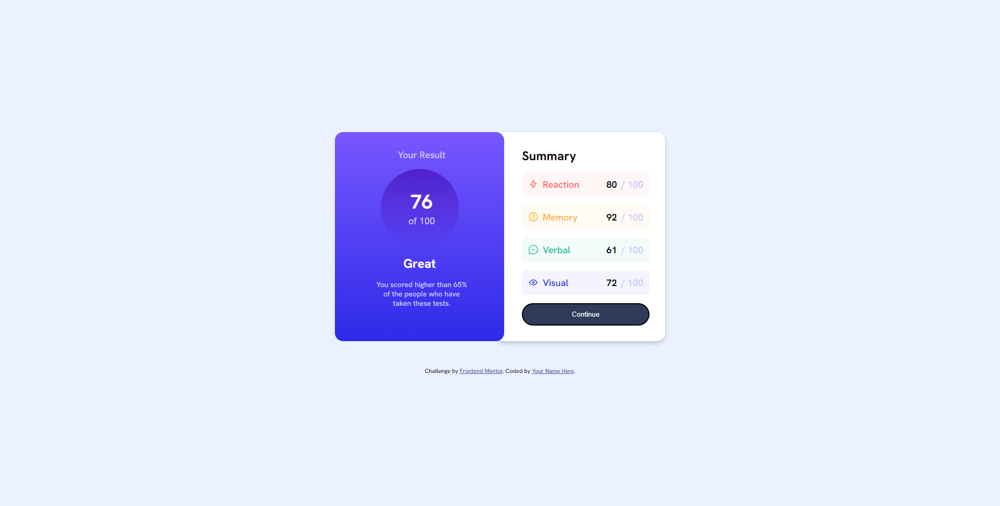

# Frontend Mentor - Results summary component solution

This is a solution to the [Results summary component challenge on Frontend Mentor](https://www.frontendmentor.io/challenges/results-summary-component-CE_K6s0maV). Frontend Mentor challenges help you improve your coding skills by building realistic projects. 

## Overview

### The challenge

Users should be able to:

- View the optimal layout for the interface depending on their device's screen size
- See hover and focus states for all interactive elements on the page

## Overview

### Screenshot

### Links

- Solution URL: [https://www.frontendmentor.io/solutions/qr-code-design-using-flexbox-EoydFllQK6](https://www.frontendmentor.io/solutions/qr-code-design-using-flexbox-EoydFllQK6)
- Live Site URL: [https://umutyg.github.io/frontendmentor.io-challenge-qrcode/](https://umutyg.github.io/frontendmentor.io-challenge-qrcode/)

## My process

### Built with

- Semantic HTML5 markup
- CSS custom properties
- Flexbox

### What I learned

I have learned flexbox deeper and worked with responsive design. I also practiced json format with JavaScript.

## Author

- Website - [Umut Yılmaz Gündüz](https://umutyg.com.tr/)
- Frontend Mentor - [@UmutYG](https://www.frontendmentor.io/profile/yourusername)

